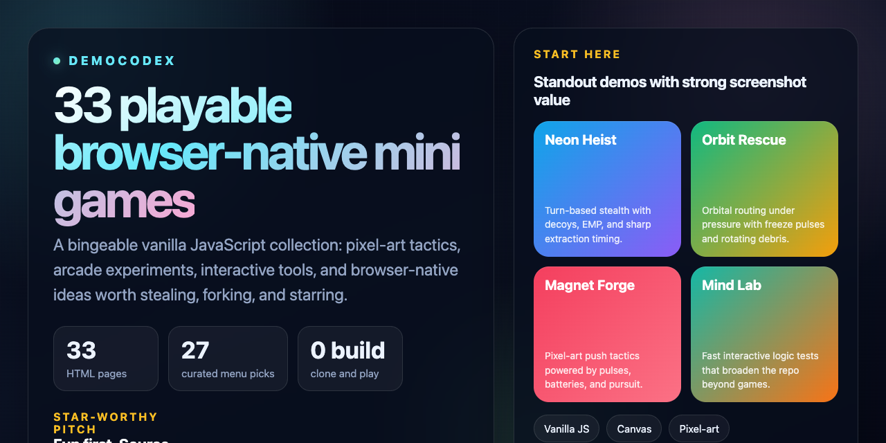

# DemoCodex

<p align="center">
  
</p>

<p align="center">
  <strong>A browser-native launch shelf for mini games, pixel experiments, and interactive demos.</strong><br />
  Open fast. Play immediately. Fork without ceremony.
</p>

<p align="center">
  
  
  
  
</p>

<p align="center">
  <a href="./index.html"><strong>Open the collection</strong></a> ·
  <a href="https://hrniux.github.io/demoCodex/"><strong>Play the live site</strong></a> ·
  <a href="./CONTRIBUTING.md"><strong>Contribute a new idea</strong></a> ·
  <a href="./.github/project-about.md"><strong>GitHub About copy</strong></a>
</p>

> 一个以原生 Web 技术构建的小游戏与互动实验合集。  
> A curated collection of browser-native mini games, pixel-art experiments, and interactive demos.

DemoCodex 聚焦于“无需构建、打开即玩”的浏览器体验。当前仓库包含 57 个可直接运行的 HTML 页面，其中 `index.html` 聚合了 51 个主推作品；其余页面保留为实验原型、历史版本或扩展说明页，方便继续迭代和对照实现。

如果这个仓库给你带来一个可复用的玩法灵感、一个值得拆解的页面结构，或者只是给你 5 分钟好玩的浏览器时光，欢迎直接点个 Star。

## Launchpad

<table>
  <tr>
    <td width="33%" valign="top">
      <h3>Play The Shelf</h3>
      <p><a href="./index.html"><strong>Open the collection</strong></a></p>
      <p>
        直接进入主入口，按分类、搜索、排序、收藏和最近打开记录快速找到下一页要玩的作品。
      </p>
    </td>
    <td width="33%" valign="top">
      <h3>Open The Source</h3>
      <p><a href="https://github.com/hrniux/demoCodex"><strong>Browse the repo</strong></a></p>
      <p>
        主推页面持续拆成 <code>HTML + src/css + src/js</code> 结构，适合直接拆解、复用和改造。
      </p>
    </td>
    <td width="33%" valign="top">
      <h3>Run The Rig</h3>
      <p><strong><code>npm run check:manifest</code> + <code>npm run test:browser</code></strong></p>
      <p>
        首页数量、README 声明和本机 Chrome 浏览器回归已经接成统一验证链路。
      </p>
    </td>
  </tr>
</table>

## Featured Shelf

<table>
  <tr>
    <td width="50%" valign="top">
      <h3><a href="./neon-heist.html">neon-heist</a></h3>
      <p><strong>Turn-based neon stealth.</strong></p>
      <p>巡逻同步推进、EMP 停滞、诱饵错位和撤离路线计算放在同一局节奏里。</p>
      <p>
        
        
      </p>
    </td>
    <td width="50%" valign="top">
      <h3><a href="./orbit-rescue.html">orbit-rescue</a></h3>
      <p><strong>Orbital recovery under pulse timing.</strong></p>
      <p>环带换位、停滞脉冲和节拍式移动结合得很紧，最适合展示仓库的策略节奏感。</p>
      <p>
        
        
      </p>
    </td>
  </tr>
  <tr>
    <td width="50%" valign="top">
      <h3><a href="./magnet-forge.html">magnet-forge</a></h3>
      <p><strong>Pixel push-box with magnetic pressure.</strong></p>
      <p>磁力牵引、供电目标和巡检火花追击叠在一起，完成度和可复用性都很高。</p>
      <p>
        
        
      </p>
    </td>
    <td width="50%" valign="top">
      <h3><a href="./cavern-blast.html">cavern-blast</a></h3>
      <p><strong>Blast timing and swarm pressure.</strong></p>
      <p>延时爆炸、碎岩清障和虫群追击的可围观感很强，适合作为仓库的视觉型代表作。</p>
      <p>
        
        
      </p>
    </td>
  </tr>
  <tr>
    <td width="50%" valign="top">
      <h3><a href="./mind-lab.html">mind-lab</a></h3>
      <p><strong>Light interactive content, not just games.</strong></p>
      <p>证明仓库不只会做街机，也能把轻互动内容页做得简洁、清楚而且好点开。</p>
      <p>
        
        
      </p>
    </td>
    <td width="50%" valign="top">
      <h3><a href="./compound_interest.html">compound_interest</a></h3>
      <p><strong>Visualization with narrative payoff.</strong></p>
      <p>图表、故事线和滚雪球演示被整合成一个完整案例，能看出仓库的另一条产品化路线。</p>
      <p>
        
        
      </p>
    </td>
  </tr>
</table>

## Why It Hits

- Instant payoff: 绝大多数页面不需要构建，拉下来就能打开试玩。
- Wide taste range: 同一个仓库里既有像素策略、经典益智，也有知识型互动与创意实验页。
- Strong source value: 大量页面已经拆成 `HTML + src/css + src/js` 的可复用结构，适合直接参考实现。
- Honest craft: 仓库保留了主推页面、实验页和历史版本，方便对照思路演进，而不是只堆结果截图。

## Start With These

| 页面 | 类型 | 为什么先看它 |
| --- | --- | --- |
| [`neon-heist.html`](./neon-heist.html) | 潜行解谜 | 回合推进 + 诱饵错位 + EMP 节奏，最适合展示“机制设计感”。 |
| [`orbit-rescue.html`](./orbit-rescue.html) | 轨道策略 | 环带换位与停滞脉冲结合，单局节奏很紧。 |
| [`magnet-forge.html`](./magnet-forge.html) | 像素策略 | 磁力推箱、追击火花和供电目标组合得很完整。 |
| [`cavern-blast.html`](./cavern-blast.html) | 像素爆破 | 爆炸时序、碎岩清障和虫群追击非常适合被围观。 |
| [`solar-sentry.html`](./solar-sentry.html) | 像素策略 | 光核回收、清场脉冲和高速回航结合得很干净。 |
| [`relay-rush.html`](./relay-rush.html) | 滑行策略 | 长直线滑行和稳频冻结把节奏拉得非常紧。 |
| [`mind-lab.html`](./mind-lab.html) | 交互测试 | 不只是游戏，展示了仓库在“轻量互动网页”上的另一条路线。 |
| [`compound_interest.html`](./compound_interest.html) | 可视化实验 | 复利主题页把图表、故事线和滚雪球演示做成了一个完整案例。 |

## Fast Facts

- `57` 个可直接运行的 HTML 页面
- `51` 个首页主推入口
- `100` 个 `src/js` / `src/css` 文件
- `npm run check:manifest` 会对 README 声明、首页入口数和仓库真实页面数做一致性校验
- `npm run test:browser` 使用本机 `Google Chrome` 跑统一浏览器回归，不回退到 Playwright bundled browser

## 项目亮点

- 原生技术栈：以 HTML、CSS、JavaScript、Canvas 与 ES Modules 为核心，不依赖前端框架。
- 上手门槛低：克隆仓库后即可通过本地静态服务器访问，无需安装构建工具。
- 合集更好逛：`index.html` 现在支持搜索、分类筛选、收藏与最近打开记录，适合快速挑到下一页要玩的作品。
- 题材覆盖广：包含街机、解谜、像素科普、交互式内容与浏览器实验作品。
- 本地优先：多个页面使用 `localStorage` 保存高分、最佳时间或用户状态。
- 结构可持续：复杂页面逐步拆到 `src/css` 与 `src/js`，便于维护和复用。

## 从哪里开始

推荐入口是 [`index.html`](./index.html)，它提供当前主推页面的统一导航，并支持搜索、分类筛选、收藏以及最近打开记录。

### 本地运行

```bash
git clone https://github.com/hrniux/demoCodex.git
cd demoCodex
python3 -m http.server 8000
```

然后在浏览器中访问：

- `http://localhost:8000/index.html`

说明：

- 大多数单文件页面可直接打开。
- 含 ES Module 的页面更适合通过本地静态服务器访问，兼容性更稳定。
- `voxelcraft.html` 依赖 CDN 加载 `three.js`，需要联网。

### 本地验证

```bash
npm install
npm run check:manifest
npm test
npm run test:browser
```

补充说明：

- `npm run check:manifest` 会核对仓库 HTML 总数、`index.html` 主推卡片数量，以及 README 中声明的页面数是否一致。
- `npm test` 运行当前内建的逻辑自检，现已覆盖 37 个主推页面逻辑，其中包括策略游戏与轻量应用。
- `npm run test:browser` 会自动拉起仓库根目录的本地静态服务，再顺序执行当前已接入统一套件的主推像素游戏浏览器回归。
- 浏览器回归只使用本机已安装的 `Google Chrome`；如路径不在默认位置，可通过环境变量 `DEMOCODEX_CHROME_EXECUTABLE` 指向现有本机 Chrome 可执行文件。
- 仓库不会回退到 Playwright bundled browser，也不需要为本项目运行 `playwright install`。

## 作品清单

### 合集主推页面

| 类型 | 页面 | 简述 |
| --- | --- | --- |
| 导航入口 | `index.html` | DemoCodex 主合集页，适合作为仓库首页和试玩入口。 |
| 个性化内容 | `daily-insights.html` | 融合生肖、星座与节气的每日洞见生成器。 |
| 结构化工具 | `bazi-insights.html` | 输入出生信息后生成五行偏向、性格侧重与行动建议的规则映射工具。 |
| 结构化工具 | `mind-lab.html` | 8 题轻量逻辑测试，提供即时得分、结果分段与简短解读。 |
| 结构化工具 | `focus-weave.html` | 根据时间、能量和任务类型生成短时专注编排与执行时间轴。 |
| 结构化工具 | `decision-compass.html` | 基于紧急度、可逆性和把握度给出明确的决策动作、检查点和风险边界。 |
| 结构化工具 | `meeting-weave.html` | 根据会议目标、人数和时长生成主持结构、时间盒和会后收口建议。 |
| 结构化工具 | `priority-canvas.html` | 综合影响、投入、期限和依赖给任务排序，并定位到优先级画布中的合适位置。 |
| 像素街机 | `tank-battle-pixel.html` | 简约像素风坦克大战，强调基地防守、轻量 AI 和零依赖。 |
| 像素策略 | `ember-shift.html` | 像素火线推箱谜局，把水桶送进火点并用泡沫冻结余烬。 |
| 像素策略 | `rail-rift.html` | 断轨峡谷中的补给调度关卡，围绕收集、切线与跃轨窗口展开。 |
| 像素策略 | `glyph-keeper.html` | 符文收集与暗影追逐结合的小型守门关卡。 |
| 像素策略 | `magnet-forge.html` | 像素风磁力推箱谜局，用推动与脉冲牵引把磁芯电池送进反应座，并躲开巡检火花。 |
| 像素策略 | `pixel-orchard.html` | 果园采收街机，边摘果边躲乌鸦，用惊鸟哨抢节奏。 |
| 像素策略 | `signal-sprint.html` | 惯性滑行与芯片收集结合的像素冲刺关卡。 |
| 像素策略 | `vault-pusher.html` | 金库推箱变体，把金条箱推上称重点并躲开探灯。 |
| 像素策略 | `comet-lantern.html` | 夜巡拾星小游戏，用闪灯脉冲震开黑影并回收彗尘。 |
| 像素爆破 | `cavern-blast.html` | 像素风回合制爆破地城，围绕雷芯延时爆炸、碎岩清障与虫群追击展开。 |
| 像素策略 | `frostbite-freight.html` | 冰面惯性货运谜局，利用滑行和制动器把货箱送进停靠位。 |
| 像素策略 | `moss-mission.html` | 温室潜行路线题，收回露芽样本并用灯苞脉冲清掉孢子藤。 |
| 像素策略 | `kiln-caravan.html` | 窑火推箱页，把陶坯车送上窑位后再借冷扇压住火星撤离。 |
| 像素策略 | `dock-drift.html` | 顺潮滑行的码头推箱局，用抛锚压住浪线并把补给箱送进泊位。 |
| 像素策略 | `canopy-scout.html` | 树冠潜行路线题，收回风种信标并用枝剪脉冲清掉蔓刺。 |
| 像素策略 | `amber-aisle.html` | 化石馆推箱小局，把封样箱推上展台后再用拍灯脉冲清场。 |
| 像素策略 | `aurora-breach.html` | 雪原回收关卡，收回极核样本并用极光静场压住风暴影。 |
| 像素策略 | `reef-keeper.html` | 守礁推箱局，把珊瑚环压上潮锚并用潮钟冻结近处海流。 |
| 像素策略 | `orchid-guard.html` | 温室花圃推箱守卫，把花架推进花床基座并用花雾拖住虫群。 |
| 像素策略 | `signal-dunes.html` | 沙海滑行回收关，沿沙脊收回信标并用沙幕吹散贴身幻影。 |
| 像素策略 | `volt-pier.html` | 港口电力防线，把电容箱推上闸位后用断路器压住浪涌。 |
| 像素策略 | `solar-sentry.html` | 太阳阵列巡检关卡，回收光核后用日冕脉冲扫开碎片再撤离。 |
| 像素策略 | `crate-circuit.html` | 机房接线推箱页，把电路箱送上节点后卡着断流窗口穿过闸门。 |
| 像素策略 | `reef-raider.html` | 海床打捞路线题，收回遗物、冻结潮流，再从右下角出口带着成果撤走。 |
| 像素策略 | `forge-feint.html` | 锻炉主题推箱页，推动钢胚压住锻点并用冷锤冻结火星。 |
| 像素策略 | `prism-patrol.html` | 棱镜采集路线关，围绕短线收束、锁光停顿和干净撤离展开。 |
| 像素策略 | `glacier-switch.html` | 冰面滑行推箱页，用雪楔清掉冰刺，再靠惯性把货箱送上停靠位。 |
| 像素策略 | `thorn-trail.html` | 慢节奏林径采集关，藤刺会扩散，修枝刀负责切出短暂安全路线。 |
| 像素策略 | `relay-rush.html` | 滑行信道冲刺局，收满中继节点后再靠稳频波压住干扰完成回航。 |
| 像素策略 | `lumen-lift.html` | 补光塔主题推箱页，把棱镜箱送上光台并靠聚光脉冲拖住暗影。 |
| 像素策略 | `quarry-quest.html` | 矿区推石撤离关，把矿石推进标记槽后从北侧井口带走样本。 |
| 潜行解谜 | `neon-heist.html` | 回合制霓虹潜入小游戏，围绕巡逻同步推进、EMP 停滞、诱饵错位与路线计算展开。 |
| 轨道策略 | `orbit-rescue.html` | 环形轨道回收游戏，利用停滞脉冲与节拍式移动在碎片环带间抢回救生舱。 |
| 港湾策略 | `tide-courier.html` | 港湾潮道投递谜局，利用潮流拖拽与换流浮标反转航道，在驳船间抢回漂流货箱。 |
| 经典休闲 | `snake_game.html` | 经典贪吃蛇，高分可本地保存。 |
| 科普互动 | `dino-pixel-encyclopedia.html` | 像素风恐龙百科，兼顾视觉和知识内容。 |
| 科普互动 | `armory-pixel-arsenal.html` | 像素兵工图鉴，以专题内容页形式展示武器演进。 |
| 科普互动 | `dinosaur_museum.html` | 虚拟恐龙博物馆页面，侧重沉浸式浏览。 |
| 生存动作 | `stellar-escape.html` | 护盾、冲刺与高分追逐结合的太空生存街机体验。 |
| 记忆挑战 | `echo-matrix.html` | 记忆序列与节奏压力结合的霓虹风挑战。 |
| 经典益智 | `tetris.html` | 俄罗斯方块，支持幽灵提示、逐级加速和本地高分。 |
| 经典益智 | `minesweeper.html` | 扫雷，含多难度和最佳时间记录。 |
| 经典益智 | `2048.html` | 2048 滑块合并玩法，支持触摸与键盘。 |
| 街机复刻 | `flappy-bird.html` | 像素飞鸟，一键操作的高分挑战。 |

### 实验与历史页面

| 页面 | 定位 |
| --- | --- |
| `physics_playground.html` | 物理概念展示型页面，使用多个 Canvas 小实验解释基础现象。 |
| `compound_interest.html` | 复利主题的交互式可视化实验页，结合 Chart.js 图表、时间线与滚雪球演示解释长期投资中的复利效应。 |
| `voxelcraft.html` | 基于 `three.js` 的单文件体素世界实验，是仓库中少数依赖外部 CDN 的页面。 |
| `tank-battle.html` | 功能更重的坦克大战历史版本，保留作参考实现。 |
| `tank-battle-achievements.html` | 坦克大战成就展示页，与历史版本配套。 |

## 技术特征

- 渲染方式：Canvas 2D 是主要交互载体，部分页面采用像素风绘制和 `requestAnimationFrame` 循环。
- 代码组织：仓库同时存在单文件原型页与按 `src/css`、`src/js` 拆分的模块化页面。
- 状态持久化：贪吃蛇、2048、扫雷、俄罗斯方块、回声矩阵、星环逃逸、霓虹潜行、轨道营救、潮汐信使、晶洞爆破、磁场工坊、余烬搬运、裂轨列调、符文守卫、像素果园、信号冲刺、金库推箱、彗灯拾星、霜轨货运、太阳哨站、箱线回路、暗礁打捞、炉火佯动、棱镜巡线、冰川换道、荆棘小径、中继冲刺、琉光升塔、矿场追标、礁环守卫、兰园守卫、沙讯回收、潮涌码头、像素坦克等页面都使用了浏览器本地存储。
- 依赖策略：除 `voxelcraft.html`、`compound_interest.html` 和个别字体资源外，整体坚持轻依赖甚至零依赖。

## 目录结构

```text
.
├── index.html                     # 合集入口 / 默认首页
├── *.html                         # 各独立页面与实验原型
├── src/
│   ├── css/                       # 页面样式
│   └── js/                        # 页面脚本与可复用模块
├── assets/                        # 预留静态资源目录
├── DAILY_INSIGHTS_README.md       # Daily Insights 专项文档
├── TANK_BATTLE_README.md          # 历史坦克大战专项文档
└── .github/project-about.md       # GitHub About 文案源文件
```

## 适合这个仓库的协作方式

- 新增主推页面时，优先把 HTML 保持为骨架，并把样式与逻辑拆到 `src/css`、`src/js`。
- 如果新增的是合集级作品，记得同步更新 `index.html` 的入口和简介。
- 尽量减少外部依赖；若必须引入 CDN 或第三方资源，请在页面头部和 README 中说明。
- 提交前至少用本地静态服务器做一轮人工检查，确认入口、交互和资源路径可用。

## 专项文档

- [`DAILY_INSIGHTS_README.md`](./DAILY_INSIGHTS_README.md)
- [`DAILY_INSIGHTS_QUICKSTART.md`](./DAILY_INSIGHTS_QUICKSTART.md)
- [`TANK_BATTLE_README.md`](./TANK_BATTLE_README.md)
- [`TANK_BATTLE_QUICKSTART.md`](./TANK_BATTLE_QUICKSTART.md)

## GitHub About

仓库 About 的推荐描述、主题标签、社交预览素材建议和 GitHub Pages 配置建议已经整理在 [`./.github/project-about.md`](./.github/project-about.md)。如果你启用了 GitHub Pages，可以直接按该文件中的建议补上项目主页。
